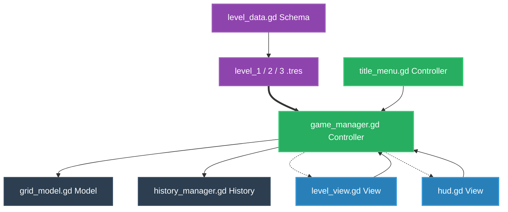
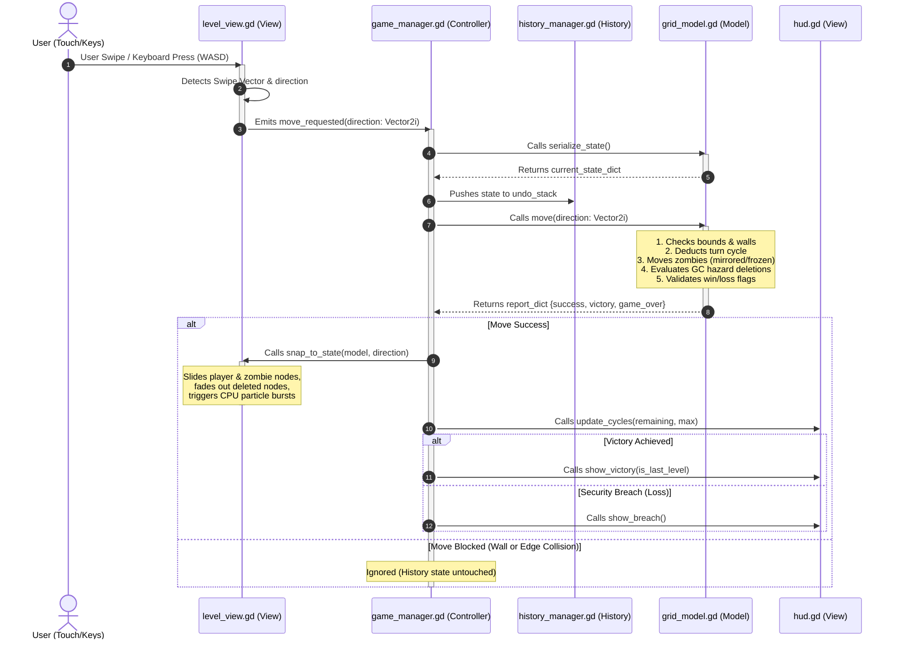

# Grid Walker

Grid Walker is a polished, cyberpunk-themed mobile portrait puzzle game built using **Godot 4**. The project is designed with a strict **Model-View-Controller (MVC)** separation, separating core logic calculations from UI and presentation frameworks to ensure scalability, testability, and portability.

---

## 🎮 Core Game Loop & Gameplay Hooks
The player controls the green **Admin Node** with the goal of reaching the magenta **Exit Portal** before running out of **cycles (steps)**.

### 💡 Mechanics and Hooks
To elevate engagement, Grid Walker features three custom gameplay obstacles and power-ups:
1.  **Mirrored Threat AI (Zombies)**: Active red threat nodes mirror the player's inputs in reverse. Collision with threats results in a security breach (Game Over).
2.  **Garbage Collection (GC) Hazards**: Cyan hazard tiles delete threats that step onto them. **The Exit Portal remains locked until all active threats are deleted** from the system matrix.
3.  **EMP Overrides (Power-ups)**: Golden EMP tiles can be collected to freeze threat nodes in place for `2` turns, allowing players to navigate tight corners safely.

---

## 🛠️ Technical Architecture & Data flow

The codebase enforces a clean separation of concerns. The core game logic executes independently of Godot's visual node tree and coordinates rendering frame rates.

### 1. System Architecture Map
This map charts the concrete component relationships and boundaries between data models, logic orchestrators, and UI presenting canvas layers:

### 2. Functional Code Flow
The sequence diagram below maps the complete lifecycle of a single gameplay step: from initial user touch swipe to grid matrix evaluation, state history serialization, and dynamic rendering triggers:

---

## 💾 Engineering & Algorithmic Design Patterns

### Decoupled Code Architecture
*   **Logical Independence**: `src/core/grid_model.gd` contains no Node dependency, no rendering calls, and no engine-specific UI loops. It runs mathematical grid calculations using basic structures, making it unit-testable in isolation.
*   **Strict Type Safety**: All scripts enforce static typing (`var x: int`, `func f() -> Vector2i`) to prevent runtime type errors and maximize compiler execution efficiency.

### Memory-Safe History Stack
*   **Serialization Snapshotting**: Instead of deep-duplicating complex Node objects (which causes memory leaks, frame drops, and garbage collection overhead), the history engine uses a lightweight JSON-like dictionary serialization.
*   **Instant Time Travel**: When clicking **Undo** or **Redo**, `history_manager.gd` passes the matching state dictionary back to the model, which repopulates variables instantly before `LevelView` animates nodes smoothly to match.

---

## 🕹️ Controls & Setup

### Setup & Play
*   Open the folder inside the **Godot Editor 4.x**.
*   Press **`F5`** (or Click Play) to launch the Title Screen.
*   Go to **`HOW TO PLAY`** on the Title Screen to view standard rules.

### Input Mapping
*   **Desktop Controls**: Use `W`, `A`, `S`, `D` or `Arrow Keys` to move. Press `Z` to Undo and `Y` to Redo.
*   **Mobile Controls**: Swipe in any direction on screen. Tap bottom HUD overlays to Undo/Redo or return to menu.
